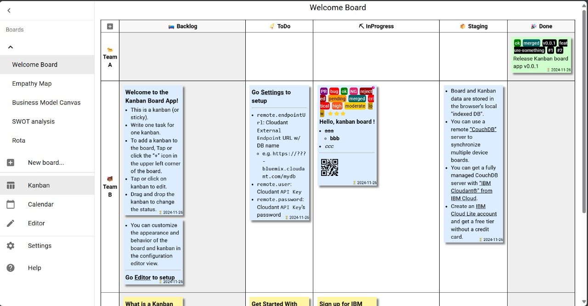

# Board Gallery

### To import the following examples:
1. Click `New board...` to create a board.
1. Open the `Editor` view of the board that created.
1. Paste the configuration text and click the `Save` button.


-----
## Basic Kanban board



<details>
<summary>Click to open board configuration text</summary>

```yaml
name: Basic Kanban board
taskStatuses:
  - value: Backlog
    caption: "\U0001F6CC Backlog"
    className: status-backlog
  - value: ToDo
    caption: "\U0001F4EF ToDo"
    className: status-todo
  - value: InProgress
    caption: ⛏ InProgress
    className: status-inprogress
  - value: Staging
    caption: "\U0001F4E6 Staging"
    className: status-staging
  - value: Done
    caption: "\U0001F389 Done"
    className: status-done
    completed: true
teamOrStories:
  - value: Team A
    caption: ✨ Enhancement
    className: team-or-story-team-a
  - value: Team B
    caption: "\U0001F41E Bugs"
    className: team-or-story-team-b
  - value: Team C
    caption: "\U0001F440 Improvement"
    className: team-or-story-team-c
  - value: Team D
    caption: "\U0001F4AC Support"
    className: team-or-story-team-d
tags:
  - value: bug
    className: tag-bug
  - value: ok
    className: tag-ok
  - value: NG
    className: tag-NG
  - value: PR
    className: tag-PR
  - value: rejected
    className: tag-rejected
  - value: pending
    className: tag-pending
  - value: merged
    className: tag-merged
  - value: critical
    className: tag-critical
  - value: high
    className: tag-high
  - value: moderate
    className: tag-moderate
  - value: low
    className: tag-low
  - value: ⭐
    className: tag-star
  - value: ⭐⭐
    className: tag-star
  - value: ⭐⭐⭐
    className: tag-star
displayBarcode: true
displayMemo: true
displayFlags: true
displayTags: true
preferArchive: false
boardStyle: |
  /* per-board customized styles */
  /*
  .KanbanBoardView-sticky-note {width: 200px}
  .KanbanBoardView-header-cell-task-statuses {min-width: 210px}
  table.KanbanBoardView-board tbody th {
      padding: 10px;
      white-space: nowrap;
  }
  */
  table.KanbanBoardView-board thead th.status-backlog {
      background-color: var(--weak-header-bg-color);
  }
  table.KanbanBoardView-board td.status-backlog {
      background-color: var(--weak-data-bg-color);
  }
  table.KanbanBoardView-board thead th.status-done {
      background-color: var(--weak-header-bg-color);
  }
  table.KanbanBoardView-board td.status-done {
      background-color: var(--weak-data-bg-color);
  }
  .team-or-story-team-b .KanbanBoardView-sticky-note {
      background-color: var(--sticky-blue-color);
  }
  .status-done .KanbanBoardView-sticky-note {
      background-color: var(--sticky-green-color);
  }
  .KanbanBoardView-sticky-tags .tag-bug {
      color: white;
      background-color: red;
  }
  .KanbanBoardView-sticky-tags .tag-ok {
      color: white;
      background-color: green;
  }
  .KanbanBoardView-sticky-tags .tag-NG {
      color: white;
      background-color: #e91e63;
  }
  .KanbanBoardView-sticky-tags .tag-PR {
      color: white;
      background-color: purple;
  }
  .KanbanBoardView-sticky-tags .tag-rejected {
      color: white;
      background-color: #990000;
  }
  .KanbanBoardView-sticky-tags .tag-pending {
      color: black;
      background-color: #ff9900;
  }
  .KanbanBoardView-sticky-tags .tag-merged {
      color: white;
      background-color: #006666;
  }
  .KanbanBoardView-sticky-tags .tag-critical {
      color: white;
      background-color: red;
  }
  .KanbanBoardView-sticky-tags .tag-high {
      color: white;
      background-color: #ff5522;
  }
  .KanbanBoardView-sticky-tags .tag-moderate {
      color: black;
      background-color: #ffcc00;
  }
  .KanbanBoardView-sticky-tags .tag-low {
      color: black;
      background-color: #cc9900;
  }
  .KanbanBoardView-sticky-tags .tag-star {
      color: inherit;
      background-color: inherit;
  }
calendarStyle: |
  /* per-board customized styles */
  div.CalendarView-item-chip.status-done {
      background-color: var(--sticky-green-color);
  }
boardNote: '# WIP limits=2'
records:
  - _id: 222713cd-8be7-475a-a2b6-2a62bca046c6
    dueDate: '2019-10-12'
    taskStatus: Done
    teamOrStory: Team A
    flags: []
    tags:
      - ok
      - merged
      - v0.0.1
      - feature-something
      - '#1'
      - '#2'
    description: Release Kanban board app v0.0.1
    barcode: ''
    memo: ''
```

</details>