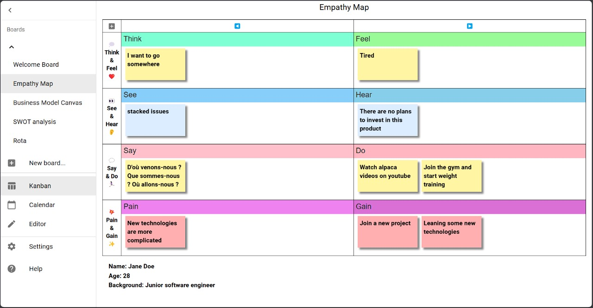

## Empathy Map



<details>
<summary>Click to open board configuration text</summary>

```yaml
name: Empathy Map
taskStatuses:
  - value: ToDo
    caption: ◀️
    className: status-todo
  - value: InProgress
    caption: ▶️
    className: status-inprogress
teamOrStories:
  - value: Team A
    caption: "\U0001F4AD Think & Feel ❤️"
    className: team-or-story-team-a
  - value: Team B
    caption: "\U0001F440 See & Hear \U0001F442"
    className: team-or-story-team-b
  - value: Team C
    caption: "\U0001F4AC Say & Do \U0001F3C3\U0001F3FB‍♀️"
    className: team-or-story-team-c
  - value: Team D
    caption: "\U0001F4A5 Pain & Gain ✨"
    className: team-or-story-team-d
tags:
  - value: bug
    className: tag-bug
  - value: ok
    className: tag-ok
  - value: NG
    className: tag-NG
  - value: PR
    className: tag-PR
  - value: rejected
    className: tag-rejected
  - value: pending
    className: tag-pending
  - value: merged
    className: tag-merged
  - value: critical
    className: tag-critical
  - value: high
    className: tag-high
  - value: moderate
    className: tag-moderate
  - value: low
    className: tag-low
  - value: ⭐
    className: tag-star
  - value: ⭐⭐
    className: tag-star
  - value: ⭐⭐⭐
    className: tag-star
displayBarcode: true
displayMemo: true
displayFlags: true
displayTags: true
preferArchive: false
boardStyle: |
  /* per-board customized styles */
  /*
  .KanbanBoardView-sticky-note {width: 200px}
  table.KanbanBoardView-board tbody th {
      padding: 10px;
      white-space: nowrap;
  }
  */
  .KanbanBoardView-header-cell-task-statuses {width: 50%}
  table.KanbanBoardView-board thead th.status-backlog {
      background-color: var(--weak-header-bg-color);
  }
  table.KanbanBoardView-board td.status-backlog {
      background-color: var(--weak-data-bg-color);
  }
  table.KanbanBoardView-board thead th.status-done {
      background-color: var(--weak-header-bg-color);
  }
  table.KanbanBoardView-board td.status-done {
      background-color: var(--weak-data-bg-color);
  }
  .team-or-story-team-b .KanbanBoardView-sticky-note {
      background-color: var(--sticky-blue-color);
  }
  .team-or-story-team-d .KanbanBoardView-sticky-note {
      background-color: var(--sticky-red-color);
  }
  .status-done .KanbanBoardView-sticky-note {
      background-color: var(--sticky-green-color);
  }
  table.KanbanBoardView-board td.status-todo.team-or-story-team-a {
      padding-top: 35px;
      background: url('data:image/svg+xml;charset=UTF-8,<svg xmlns="http://www.w3.org/2000/svg" version="1.1" viewBox="0 0 4850 35"><rect x="0" y="0" width="4850" height="35" fill="aquamarine"/><text font-size="14pt" x="5" y="5" font-family="sans-serif" dominant-baseline="text-before-edge" fill="rgb(51,51,51)">Think</text></svg>') no-repeat left top;
      background-size: 4850px 35px;
      height: 140px;
  }
  table.KanbanBoardView-board td.status-inprogress.team-or-story-team-a {
      padding-top: 35px;
      background: url('data:image/svg+xml;charset=UTF-8,<svg xmlns="http://www.w3.org/2000/svg" version="1.1" viewBox="0 0 4850 35"><rect x="0" y="0" width="4850" height="35" fill="palegreen"/><text font-size="14pt" x="5" y="5" font-family="sans-serif" dominant-baseline="text-before-edge" fill="rgb(51,51,51)">Feel</text></svg>') no-repeat left top;
      background-size: 4850px 35px;
      height: 140px;
  }
  table.KanbanBoardView-board td.status-todo.team-or-story-team-b {
      padding-top: 35px;
      background: url('data:image/svg+xml;charset=UTF-8,<svg xmlns="http://www.w3.org/2000/svg" version="1.1" viewBox="0 0 4850 35"><rect x="0" y="0" width="4850" height="35" fill="lightskyblue"/><text font-size="14pt" x="5" y="5" font-family="sans-serif" dominant-baseline="text-before-edge" fill="rgb(51,51,51)">See</text></svg>') no-repeat left top;
      background-size: 4850px 35px;
      height: 140px;
  }
  table.KanbanBoardView-board td.status-inprogress.team-or-story-team-b {
      padding-top: 35px;
      background: url('data:image/svg+xml;charset=UTF-8,<svg xmlns="http://www.w3.org/2000/svg" version="1.1" viewBox="0 0 4850 35"><rect x="0" y="0" width="4850" height="35" fill="skyblue"/><text font-size="14pt" x="5" y="5" font-family="sans-serif" dominant-baseline="text-before-edge" fill="rgb(51,51,51)">Hear</text></svg>') no-repeat left top;
      background-size: 4850px 35px;
      height: 140px;
  }
  table.KanbanBoardView-board td.status-todo.team-or-story-team-c {
      padding-top: 35px;
      background: url('data:image/svg+xml;charset=UTF-8,<svg xmlns="http://www.w3.org/2000/svg" version="1.1" viewBox="0 0 4850 35"><rect x="0" y="0" width="4850" height="35" fill="pink"/><text font-size="14pt" x="5" y="5" font-family="sans-serif" dominant-baseline="text-before-edge" fill="rgb(51,51,51)">Say</text></svg>') no-repeat left top;
      background-size: 4850px 35px;
      height: 140px;
  }
  table.KanbanBoardView-board td.status-inprogress.team-or-story-team-c {
      padding-top: 35px;
      background: url('data:image/svg+xml;charset=UTF-8,<svg xmlns="http://www.w3.org/2000/svg" version="1.1" viewBox="0 0 4850 35"><rect x="0" y="0" width="4850" height="35" fill="lightpink"/><text font-size="14pt" x="5" y="5" font-family="sans-serif" dominant-baseline="text-before-edge" fill="rgb(51,51,51)">Do</text></svg>') no-repeat left top;
      background-size: 4850px 35px;
      height: 140px;
  }
  table.KanbanBoardView-board td.status-todo.team-or-story-team-d {
      padding-top: 35px;
      background: url('data:image/svg+xml;charset=UTF-8,<svg xmlns="http://www.w3.org/2000/svg" version="1.1" viewBox="0 0 4850 35"><rect x="0" y="0" width="4850" height="35" fill="violet"/><text font-size="14pt" x="5" y="5" font-family="sans-serif" dominant-baseline="text-before-edge" fill="rgb(51,51,51)">Pain</text></svg>') no-repeat left top;
      background-size: 4850px 35px;
      height: 140px;
  }
  table.KanbanBoardView-board td.status-inprogress.team-or-story-team-d {
      padding-top: 35px;
      background: url('data:image/svg+xml;charset=UTF-8,<svg xmlns="http://www.w3.org/2000/svg" version="1.1" viewBox="0 0 4850 35"><rect x="0" y="0" width="4850" height="35" fill="orchid"/><text font-size="14pt" x="5" y="5" font-family="sans-serif" dominant-baseline="text-before-edge" fill="rgb(51,51,51)">Gain</text></svg>') no-repeat left top;
      background-size: 4850px 35px;
      height: 140px;
  }
  .KanbanBoardView-sticky-tags .tag-bug {
      color: white;
      background-color: red;
  }
  .KanbanBoardView-sticky-tags .tag-ok {
      color: white;
      background-color: green;
  }
  .KanbanBoardView-sticky-tags .tag-NG {
      color: white;
      background-color: #e91e63;
  }
  .KanbanBoardView-sticky-tags .tag-PR {
      color: white;
      background-color: purple;
  }
  .KanbanBoardView-sticky-tags .tag-rejected {
      color: white;
      background-color: #990000;
  }
  .KanbanBoardView-sticky-tags .tag-pending {
      color: black;
      background-color: #ff9900;
  }
  .KanbanBoardView-sticky-tags .tag-merged {
      color: white;
      background-color: #006666;
  }
  .KanbanBoardView-sticky-tags .tag-critical {
      color: white;
      background-color: red;
  }
  .KanbanBoardView-sticky-tags .tag-high {
      color: white;
      background-color: #ff5522;
  }
  .KanbanBoardView-sticky-tags .tag-moderate {
      color: black;
      background-color: #ffcc00;
  }
  .KanbanBoardView-sticky-tags .tag-low {
      color: black;
      background-color: #cc9900;
  }
  .KanbanBoardView-sticky-tags .tag-star {
      color: inherit;
      background-color: inherit;
  }
calendarStyle: |
  /* per-board customized styles */
  div.CalendarView-item-chip.status-done {
      background-color: var(--sticky-green-color);
  }
boardNote: |
  # Name: Jane Doe
  # Age: 28
  # Background: Junior software engineer
records:
  - _id: 10d73e46-dd06-494f-9af7-aead593622e9
    dueDate: ''
    taskStatus: ToDo
    teamOrStory: Team C
    flags: []
    tags: []
    description: '# D''où venons-nous ? Que sommes-nous ? Où allons-nous ?'
    barcode: ''
    memo: ''
  - _id: 14883fb7-48bc-4735-a517-76f6eeff1ea6
    dueDate: ''
    taskStatus: InProgress
    teamOrStory: Team D
    flags: []
    tags: []
    description: '# Join a new project'
    barcode: ''
    memo: ''
  - _id: 28f0f4f7-8cef-4e99-82ca-22ba30246c10
    dueDate: ''
    taskStatus: InProgress
    teamOrStory: Team C
    flags: []
    tags: []
    description: '# Join the gym and start weight training'
    barcode: ''
    memo: ''
  - _id: 5c86e1a2-f06e-46e5-8bb1-8c45bea1a5a4
    dueDate: ''
    taskStatus: InProgress
    teamOrStory: Team B
    flags: []
    tags: []
    description: '# There are no plans to invest in this product'
    barcode: ''
    memo: ''
  - _id: 79e4b02f-f389-4b7b-a4a0-4672772ef932
    dueDate: ''
    taskStatus: ToDo
    teamOrStory: Team A
    flags: []
    tags: []
    description: '# I want to go somewhere'
    barcode: ''
    memo: ''
  - _id: 8f8ec928-bc35-4488-8473-bc7f118c4db4
    dueDate: ''
    taskStatus: InProgress
    teamOrStory: Team A
    flags: []
    tags: []
    description: '# Tired'
    barcode: ''
    memo: ''
  - _id: b7ab0301-455b-4e55-a356-0079c4ae0c54
    dueDate: ''
    taskStatus: ToDo
    teamOrStory: Team D
    flags: []
    tags: []
    description: '# New technologies are more complicated'
    barcode: ''
    memo: ''
  - _id: bec582aa-0aad-42e2-ab18-1a2aec0cd4ed
    dueDate: ''
    taskStatus: InProgress
    teamOrStory: Team D
    flags: []
    tags: []
    description: '# Leaning some new technologies'
    barcode: ''
    memo: ''
  - _id: e7b09d85-b5c3-40ed-9f1b-516e667e2eeb
    dueDate: ''
    taskStatus: InProgress
    teamOrStory: Team C
    flags: []
    tags: []
    description: '# Watch alpaca videos on youtube'
    barcode: ''
    memo: ''
  - _id: fd61e926-2738-4401-8219-413872d1962d
    dueDate: ''
    taskStatus: ToDo
    teamOrStory: Team B
    flags: []
    tags: []
    description: '# stacked issues'
    barcode: ''
    memo: ''
```

</details>