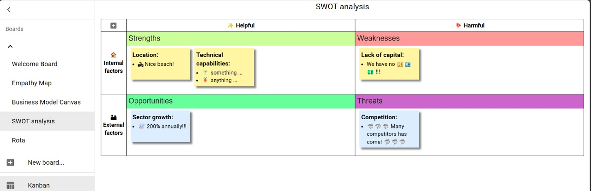

SWOT analysis



<details>
<summary>Click to open board configuration text</summary>

```yaml
name: SWOT analysis
taskStatuses:
  - value: ToDo
    caption: ✨ Helpful
    className: status-todo
  - value: InProgress
    caption: "\U0001F4A5 Harmful"
    className: status-inprogress
teamOrStories:
  - value: Team A
    caption: "\U0001F3E0 Internal factors"
    className: team-or-story-team-a
  - value: Team B
    caption: "\U0001F3DC External factors"
    className: team-or-story-team-b
tags:
  - value: bug
    className: tag-bug
  - value: ok
    className: tag-ok
  - value: NG
    className: tag-NG
  - value: PR
    className: tag-PR
  - value: rejected
    className: tag-rejected
  - value: pending
    className: tag-pending
  - value: merged
    className: tag-merged
  - value: critical
    className: tag-critical
  - value: high
    className: tag-high
  - value: moderate
    className: tag-moderate
  - value: low
    className: tag-low
  - value: ⭐
    className: tag-star
  - value: ⭐⭐
    className: tag-star
  - value: ⭐⭐⭐
    className: tag-star
displayBarcode: true
displayMemo: true
displayFlags: true
displayTags: true
preferArchive: false
boardStyle: |
  /* per-board customized styles */
  /*
  .KanbanBoardView-sticky-note {width: 200px}
  table.KanbanBoardView-board tbody th {
      padding: 10px;
      white-space: nowrap;
  }
  */
  .KanbanBoardView-header-cell-task-statuses {width: 50%}
  table.KanbanBoardView-board thead th.status-backlog {
      background-color: var(--weak-header-bg-color);
  }
  table.KanbanBoardView-board td.status-backlog {
      background-color: var(--weak-data-bg-color);
  }
  table.KanbanBoardView-board thead th.status-done {
      background-color: var(--weak-header-bg-color);
  }
  table.KanbanBoardView-board td.status-done {
      background-color: var(--weak-data-bg-color);
  }
  .team-or-story-team-b .KanbanBoardView-sticky-note {
      background-color: var(--sticky-blue-color);
  }
  .status-done .KanbanBoardView-sticky-note {
      background-color: var(--sticky-green-color);
  }
  table.KanbanBoardView-board td.status-todo.team-or-story-team-a {
      padding-top: 35px;
      background: url('data:image/svg+xml;charset=UTF-8,<svg xmlns="http://www.w3.org/2000/svg" version="1.1" viewBox="0 0 4850 35"><rect x="0" y="0" width="4850" height="35" fill="rgb(204,255,153)"/><text font-size="14pt" x="5" y="5" font-family="sans-serif" dominant-baseline="text-before-edge" fill="rgb(51,51,51)">Strengths</text></svg>') no-repeat left top;
      background-size: 4850px 35px;
      height: 140px;
  }
  table.KanbanBoardView-board td.status-inprogress.team-or-story-team-a {
      padding-top: 35px;
      background: url('data:image/svg+xml;charset=UTF-8,<svg xmlns="http://www.w3.org/2000/svg" version="1.1" viewBox="0 0 4850 35"><rect x="0" y="0" width="4850" height="35" fill="rgb(255,153,153)"/><text font-size="14pt" x="5" y="5" font-family="sans-serif" dominant-baseline="text-before-edge" fill="rgb(51,51,51)">Weaknesses</text></svg>') no-repeat left top;
      background-size: 4850px 35px;
      height: 140px;
  }
  table.KanbanBoardView-board td.status-todo.team-or-story-team-b {
      padding-top: 35px;
      background: url('data:image/svg+xml;charset=UTF-8,<svg xmlns="http://www.w3.org/2000/svg" version="1.1" viewBox="0 0 4850 35"><rect x="0" y="0" width="4850" height="35" fill="rgb(102,255,153)"/><text font-size="14pt" x="5" y="5" font-family="sans-serif" dominant-baseline="text-before-edge" fill="rgb(51,51,51)">Opportunities</text></svg>') no-repeat left top;
      background-size: 4850px 35px;
      height: 140px;
  }
  table.KanbanBoardView-board td.status-inprogress.team-or-story-team-b {
      padding-top: 35px;
      background: url('data:image/svg+xml;charset=UTF-8,<svg xmlns="http://www.w3.org/2000/svg" version="1.1" viewBox="0 0 4850 35"><rect x="0" y="0" width="4850" height="35" fill="rgb(204,102,204)"/><text font-size="14pt" x="5" y="5" font-family="sans-serif" dominant-baseline="text-before-edge" fill="rgb(51,51,51)">Threats</text></svg>') no-repeat left top;
      background-size: 4850px 35px;
      height: 140px;
  }
  .KanbanBoardView-sticky-tags .tag-bug {
      color: white;
      background-color: red;
  }
  .KanbanBoardView-sticky-tags .tag-ok {
      color: white;
      background-color: green;
  }
  .KanbanBoardView-sticky-tags .tag-NG {
      color: white;
      background-color: #e91e63;
  }
  .KanbanBoardView-sticky-tags .tag-PR {
      color: white;
      background-color: purple;
  }
  .KanbanBoardView-sticky-tags .tag-rejected {
      color: white;
      background-color: #990000;
  }
  .KanbanBoardView-sticky-tags .tag-pending {
      color: black;
      background-color: #ff9900;
  }
  .KanbanBoardView-sticky-tags .tag-merged {
      color: white;
      background-color: #006666;
  }
  .KanbanBoardView-sticky-tags .tag-critical {
      color: white;
      background-color: red;
  }
  .KanbanBoardView-sticky-tags .tag-high {
      color: white;
      background-color: #ff5522;
  }
  .KanbanBoardView-sticky-tags .tag-moderate {
      color: black;
      background-color: #ffcc00;
  }
  .KanbanBoardView-sticky-tags .tag-low {
      color: black;
      background-color: #cc9900;
  }
  .KanbanBoardView-sticky-tags .tag-star {
      color: inherit;
      background-color: inherit;
  }
calendarStyle: |
  /* per-board customized styles */
  div.CalendarView-item-chip.status-done {
      background-color: var(--sticky-green-color);
  }
boardNote: ''
records:
  - _id: 2d112183-e3c2-4c05-a020-116b076dc194
    dueDate: ''
    taskStatus: InProgress
    teamOrStory: Team A
    flags: []
    tags: []
    description: "# Lack of capital:\n* We have no \U0001F4B4\U0001F4B6\U0001F4B5 !!!"
    barcode: ''
    memo: ''
  - _id: 613f8d7f-f606-4b66-b35f-54bd24320c70
    dueDate: ''
    taskStatus: ToDo
    teamOrStory: Team B
    flags: []
    tags: []
    description: "# Sector growth:\n* \U0001F4C8 200% annually!!!"
    barcode: ''
    memo: ''
  - _id: 64abc96d-92f0-4ada-a90e-77d2d1b304b7
    dueDate: ''
    taskStatus: ToDo
    teamOrStory: Team A
    flags: []
    tags: []
    description: "# Location:\n* \U0001F3D6 Nice beach!"
    barcode: ''
    memo: ''
  - _id: 8bf36b77-315f-4593-b86c-7da38b1db74a
    dueDate: ''
    taskStatus: InProgress
    teamOrStory: Team B
    flags: []
    tags: []
    description: "# Competition:\n* \U0001F988\U0001F988\U0001F988 Many competitors has come! \U0001F988\U0001F988\U0001F988"
    barcode: ''
    memo: ''
  - _id: a2a42148-1c11-4ca7-8fdc-650b9ba594cb
    dueDate: ''
    taskStatus: ToDo
    teamOrStory: Team A
    flags: []
    tags: []
    description: "# Technical capabilities:\n* \U0001F378 something ...\n* \U0001F379 anything ..."
    barcode: ''
    memo: ''
```

</details>